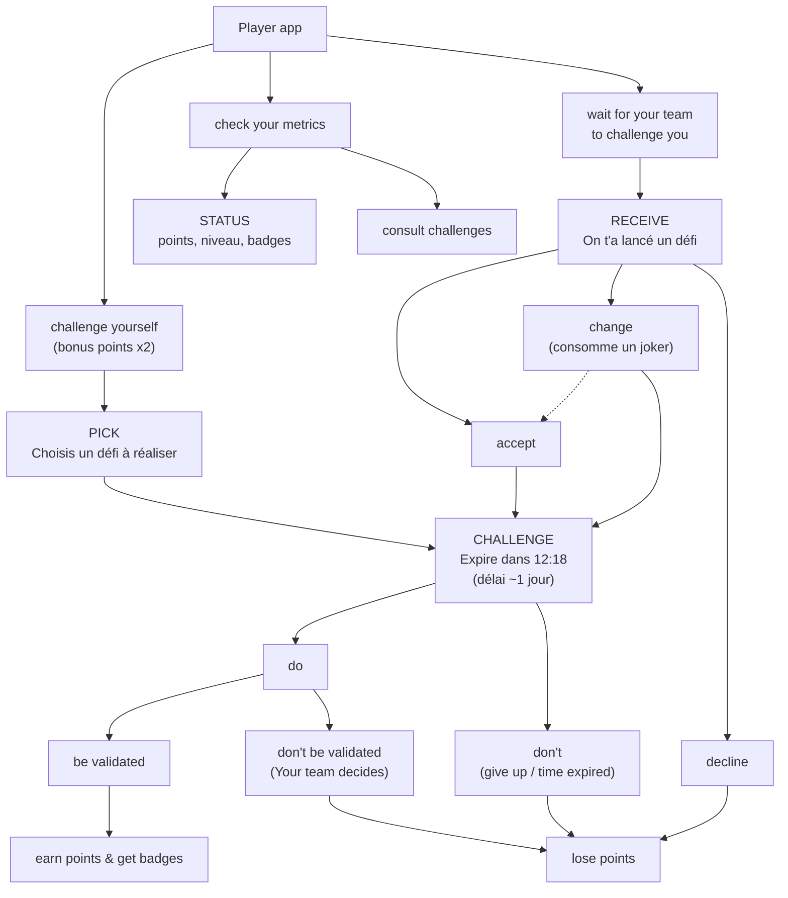
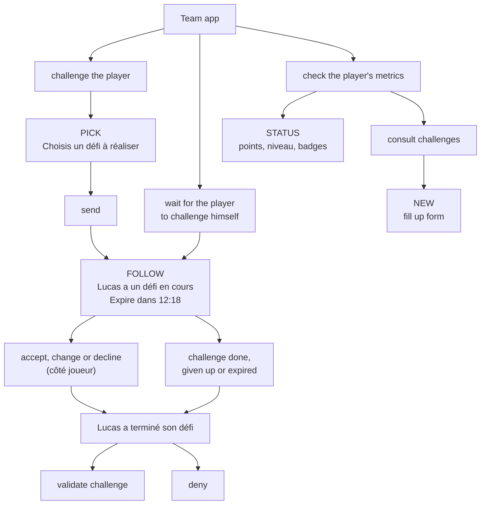

# AURA — Architecture & parcours (spec de référence)

> Traduction fidèle du schéma fourni (`Archi_wireframe_Aura_App.pdf`, 2 pages).
> Ce document décrit **deux applications distinctes** : **Player** (Lucas) et **Team**
> (ses proches). Il remplace le parcours "une seule app + sélecteur de rôle" construit
> jusqu'ici — voir la section [Écarts avec l'implémentation actuelle](#écarts-avec-limplémentation-actuelle)
> et les [Questions ouvertes](#questions-ouvertes) avant toute reconstruction.

---

## Player app

### Arborescence

### Pages (Player)

| Page | Rôle | Contenu du wireframe |
|---|---|---|
| **home** | Accueil | Header trophée + points, avatar. Bouton "Lance-toi un défi →". Sous le bouton : une grille de cases (défis/progression), certaines cochées. Si un défi est actif, l'écran **challenge** (ci-dessous) prend sa place. |
| **pick** | Choix libre | "Choisis un défi à réaliser." Pile de cartes (deck), chips de couleur des catégories en dessous pour filtrer. |
| **challenge** | Défi actif | "Tu as un défi en cours." Carte + **compte à rebours** ("Expire dans 12:18"). Écran atteint aussi bien après un choix libre (pick) qu'après acceptation d'un défi reçu. |
| **receive** | Défi reçu | "On t'a lancé un défi." Carte + 3 actions en bas : accepter / joker (changer) / refuser. |
| **status** | Profil | Trophée + points, piste de progression à jalons (pastilles), grille de badges. |

### Règles du flux (Player)

1. Deux façons d'entrer dans un défi actif : le choisir soi-même (**pick**) ou en recevoir un et l'**accepter**/le **changer** (le refus ne mène jamais à l'écran actif).
2. Une fois actif, le défi a un **délai réel** (~1 jour, décompte visible).
3. Trois façons de sortir *sans* validation, toutes perdantes en points : ne pas le faire (abandon ou expiration), le faire mais ne pas être validé par la team, ou le refuser dès réception.
4. Seul chemin gagnant : faire le défi **et** être validé par la team → points + badges.
5. Un défi choisi librement rapporte **2x points bonus** par rapport à un défi reçu (annotation sur la branche "challenge yourself").

---

## Team app

### Arborescence

### Pages (Team)

| Page | Rôle | Contenu du wireframe |
|---|---|---|
| **home** | Accueil | Header trophée + points de Lucas, avatar. Bouton "Lance un défi à Lucas →". Même grille de progression qu'côté Player. |
| **pick** | Choix pour Lucas | Même écran "Choisis un défi à réaliser" que côté Player (pile de cartes + chips couleur), mais ici la team choisit **pour** Lucas puis **envoie**. |
| **follow** | Suivi | "Lucas a un défi en cours." Carte + décompte — miroir en lecture seule de l'écran **challenge** du Player. |
| **status** | Profil de Lucas | Trophée + points + piste de progression, plus la liste des défis (cartes, avec un bouton **+**). |
| **new** | Création | Formulaire ("fill up form") : champs de texte (titre / description) + sélecteur (catégorie ou points) — **la team peut créer ses propres cartes défi**, en plus du catalogue fixe du jeu physique. |

### Règles du flux (Team)

1. La team peut soit **lancer** un défi à Lucas (pick → send), soit simplement **suivre** un défi que Lucas a lui-même choisi — les deux chemins convergent sur le même écran **follow**.
2. **follow** affiche en direct les réactions de Lucas (accepte / change / refuse) et l'issue (terminé / abandonné / expiré).
3. Décision finale toujours binaire côté team : **valider** ✓ ou **refuser** ✕ — jamais de déclaration explicite de Lucas comme "j'ai fini", cohérent avec ce qui existe déjà dans l'app.
4. La team a un pouvoir que le Player n'a pas : **créer de nouvelles cartes défi** via le formulaire **new**.

---

## Mécaniques transverses (nouvelles ou modifiées vs l'existant)

| Mécanique | Ce que dit le schéma | État actuel de l'app |
|---|---|---|
| Délai du défi | Compte à rebours réel (~1 jour), visible en permanence sur l'écran actif | Aucun délai — un défi reste actif indéfiniment |
| Refus / abandon / expiration / non-validation | **Perte de points** à chaque fois | Aucune pénalité — le défi redevient juste disponible |
| Défi choisi librement | **Bonus x2** sur les points | Même barème que défi reçu |
| Jokers | Un seul bouton "joker" générique sur l'écran **receive**, qui "consomme un joker" et revient à "accept" | 3 jokers nommés et distincts (Switch, Boomerang, Flemme), gérés à l'écran de révision |
| Défis personnalisés | La team peut créer ses propres cartes (écran **new**) | Catalogue fixe uniquement (cartes du jeu physique) |
| Deux apps | Player et Team sont deux applications séparées | Une seule app avec un sélecteur de rôle Lucas/Team (simulateur solo) |

---

## Décisions retenues (arbitrages du 2026-08-04)

| # | Question | Décision |
|---|---|---|
| 1 | Deux vraies apps ou simulation ? | **Simulation solo** — une seule app, sélecteur de rôle Lucas/Team, mais reconstruite selon ce nouveau parcours. Les vrais comptes séparés (Supabase) restent un chantier futur, non démarré. |
| 2 | "Lose points" = vraie perte ? | **Oui, soustraction réelle** du score total (plancher à 0). Un défi raté peut faire reculer Lucas d'un niveau. |
| 3 | Délai du défi | **24h fixes** pour tous les défis, décompte réel à partir de l'acceptation. |
| 4 | Bonus x2 défi libre | Confirmé, implémenté tel quel. |
| 5 | Jokers | **On garde les 3 jokers nommés** (Switch, Boomerang, Flemme), fidèles au jeu physique — le bouton "Joker" unique du schéma est une simplification de dessin, pas une consigne de fusion. |
| 6 | Badges sur échec | **Oui** — un badge de persévérance existe, obtenable même sans validation. |
| 7 | Formulaire défi perso | Titre + description + points, **catégorie pré-remplie par le chemin d'accès** (on crée un défi perso depuis l'intérieur d'une catégorie donnée, pas de sélecteur manuel). |
| 8 | Direction artistique | Pas d'éléments précis signalés en écart — on continue avec le langage visuel déjà validé (cartes, couleurs, jokers) issu du fichier d'impression, sans repasse systématique pour l'instant. |

## Modèle d'état retenu

Un arbitrage non couvert par les questions ci-dessus, tranché pour rester cohérent avec le schéma et le jeu physique :

- **Le "thème" pré-sélectionné par Lucas sur un défi envoyé par la team disparaît.** Le nouveau schéma montre la team piocher directement une carte complète (même écran **pick** que Lucas, avec les chips de couleur pour filtrer) puis l'envoyer — pas d'étape intermédiaire "Lucas choisit d'abord un thème". C'est plus simple que le mécanisme à 2 étapes construit précédemment ; à confirmer si tu préfères le garder.
- **Jokers vs "decline" : deux sorties distinctes, pas une seule.** Le schéma a un seul "decline" qui perd des points, et un "change" séparé qui ne coûte rien de spécial. Pour préserver l'intérêt des 3 jokers nommés (à usage unique chacun) tout en respectant "decline = perte de points", le modèle retenu à l'écran **receive** est :
  - **Switch** : pioche une autre carte de la même catégorie, reste sur l'écran de décision, aucune perte.
  - **Boomerang** / **Flemme** : ferment le défi reçu, **aucune perte de points** (ce sont des jokers, pas un refus sec) — réservés aux défis **reçus** (origine team), comme déjà établi.
  - **Refuser sans joker** ("decline" pur) : ferme le défi, **perd les points** de la carte — toujours disponible, y compris quand les 3 jokers sont épuisés.
- **États du run** : `received` (carte envoyée par la team, en attente de décision de Lucas) → `active` (défi en cours, décompte 24h, atteint directement pour un choix libre ou après acceptation d'un défi reçu) → résolu (`validated`, `declined`, `gave-up`, `expired`, `not-validated` — tous sauf `validated` appliquent la perte de points).
